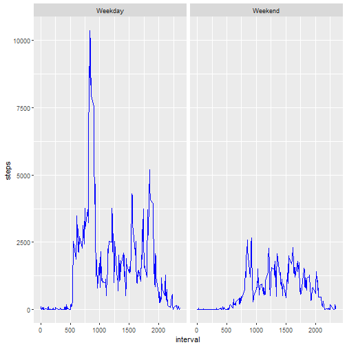

## Loading Libraries and Data


```r
library(dplyr)
library(data.table)
library(ggplot2)
library(knitr)

setwd("C:/Users/bruce/Desktop/Data/Coursera/reproducible research/hw1")

data<-fread("activity.csv")
```

## What is mean total number of steps taken per day?

For this part of the assignment, you can ignore the missing values in the dataset.

Calculate the total number of steps taken per day

If you do not understand the difference between a histogram and a barplot, research the difference between them. Make a histogram of the total number of steps taken each day

Calculate and report the mean and median of the total number of steps taken per day


```r
step_per_day<-data %>% group_by(date) %>% summarise(steps = sum(steps))
#1b.Histogram
hist(step_per_day$steps,
     xlab = "Steps",
     main = "Steps per Day")
```


```r
#1c.Calculate and report the mean and median of the total number of steps taken per day

cal<-step_per_day$steps[!is.na(step_per_day$steps)] 

mean_steps <- mean(cal)
median_steps <- median(cal)
```


```r
mean_steps
```

[1] 10766.19

```r
median_steps
```

[1] 10765

## What is the average daily activity pattern?

Make a time series plot (i.e. \color{red}{\verb|type = "l"|}type = "l") of the 5-minute interval (x-axis) and the average number of steps taken, averaged across all days (y-axis)

Which 5-minute interval, on average across all the days in the dataset, contains the maximum number of steps?


```r
data_complete<-data[complete.cases(data), ]

interval<-data_complete %>% group_by(interval) %>% summarise(steps = sum(steps))

plot(interval$interval,
     interval$steps, type = "l", xlab = "Intervals", ylab = "steps", main = "steps per interval ")
```


```r
#2b.Which 5-minute interval, on average across all the days in the dataset,
#contains the maximum number of steps?

max_interval <- interval$interval[which(interval$steps == max(interval$steps))]
max_interval
```

[1] 835

## Imputing missing values

Calculate and report the total number of missing values in the dataset (i.e. the total number of rows with \color{red}{\verb|NA|}NAs)

Devise a strategy for filling in all of the missing values in the dataset. The strategy does not need to be sophisticated. For example, you could use the mean/median for that day, or the mean for that 5-minute interval, etc.

Create a new dataset that is equal to the original dataset but with the missing data filled in.

Make a histogram of the total number of steps taken each day and Calculate and report the mean and median total number of steps taken per day. Do these values differ from the estimates from the first part of the assignment? What is the impact of imputing missing data on the estimates of the total daily number of steps?


```r
sum(is.na(data))
```

[1] 2304

```r
data_na<-data[is.na(data$steps),] 

data_non_na<-data[!is.na(data$steps),] 

#calculate mean per interval for non_na data
#From question 1 , we know that NA only appear on specific dates

step_per_day[is.na(step_per_day$steps),]
```

# A tibble: 8 x 2
  date       steps
  <chr>      <int>
1 2012-10-01    NA
2 2012-10-08    NA
3 2012-11-01    NA
4 2012-11-04    NA
5 2012-11-09    NA
6 2012-11-10    NA
7 2012-11-14    NA
8 2012-11-30    NA

```r
sum(is.na(step_per_day))
```

[1] 8

```r
#then it's better to fill in NA with mean from the specific interval where its belong to

mean_per_interval<-data_non_na %>% group_by(interval) %>% summarise(mean = mean(steps))

data_na<-left_join(data_na, mean_per_interval, by = c("interval", "interval")) 

data_na<-data.frame(steps=data_na$mean
                    ,date=data_na$date
                    ,interval=data_na$interval)

imputed_data <- rbind(data_na, data_non_na)

#3c.Make a histogram of the total number of steps taken each day

imp_per_day<-imputed_data %>% group_by(date) %>% summarise(steps = sum(steps))

hist(imp_per_day$steps, xlab = "Steps ", main = "Imputed Total steps/day")
```


```r
mean_imp_steps <- mean(imp_per_day$steps)
mean_imp_steps
```

[1] 10766.19

```r
median__imp_steps <- median(imp_per_day$steps)
median__imp_steps
```

[1] 10766.19

## Are there differences in activity patterns between weekdays and weekends?

For this part the \color{red}{\verb|weekdays()|}weekdays() function may be of some help here. Use the dataset with the filled-in missing values for this part.

Create a new factor variable in the dataset with two levels – “weekday” and “weekend” indicating whether a given date is a weekday or weekend day.
Make a panel plot containing a time series plot (i.e. \color{red}{\verb|type = "l"|}type = "l") of the 5-minute interval (x-axis) and the average number of steps taken, averaged across all weekday days or weekend days (y-axis). See the README file in the GitHub repository to see an example of what this plot should look like using simulated data.


```r
test<-ifelse(weekdays(as.POSIXct(imputed_data$date)) %in% 
               c("Sunday","Saturday"),
             "Weekend",
             "Weekday"
)

imputed_data<-imputed_data %>% mutate(day = test)

imputed_day<-imputed_data %>% group_by(day,interval) %>% summarise(steps = sum(steps))

ggplot(imputed_day, aes(interval, steps))+
  geom_line(color = "blue") +
  facet_grid(.~day) 
```


